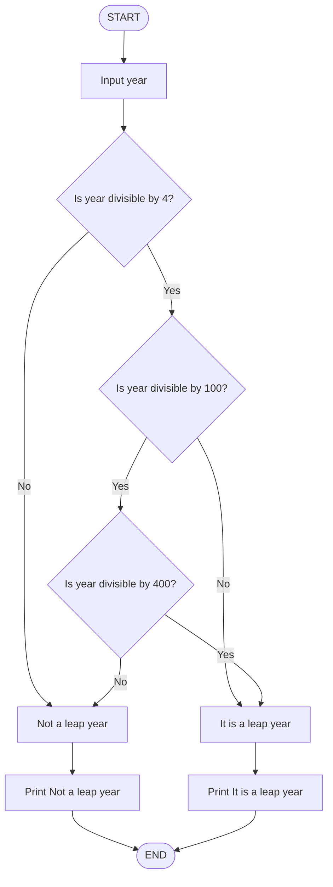
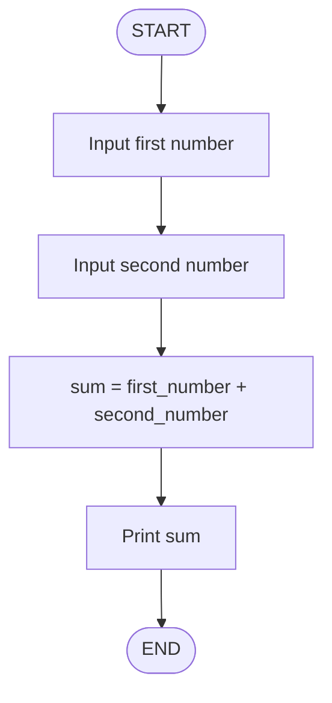
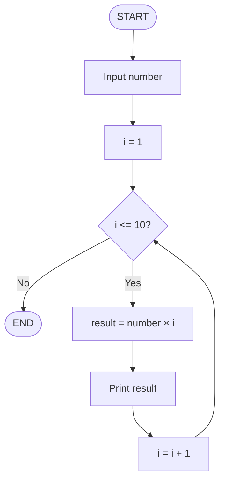
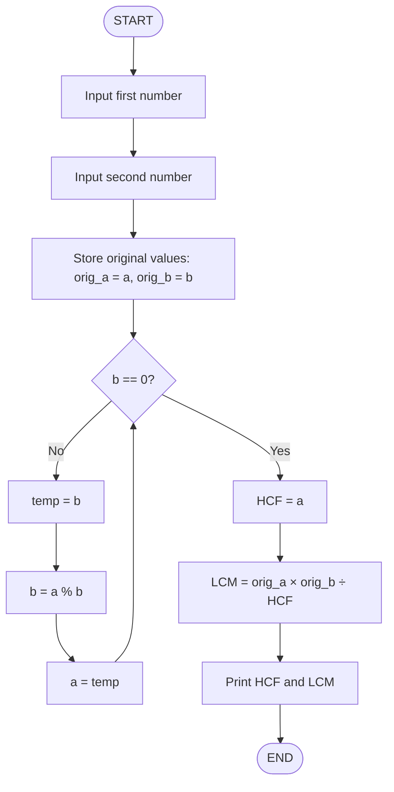
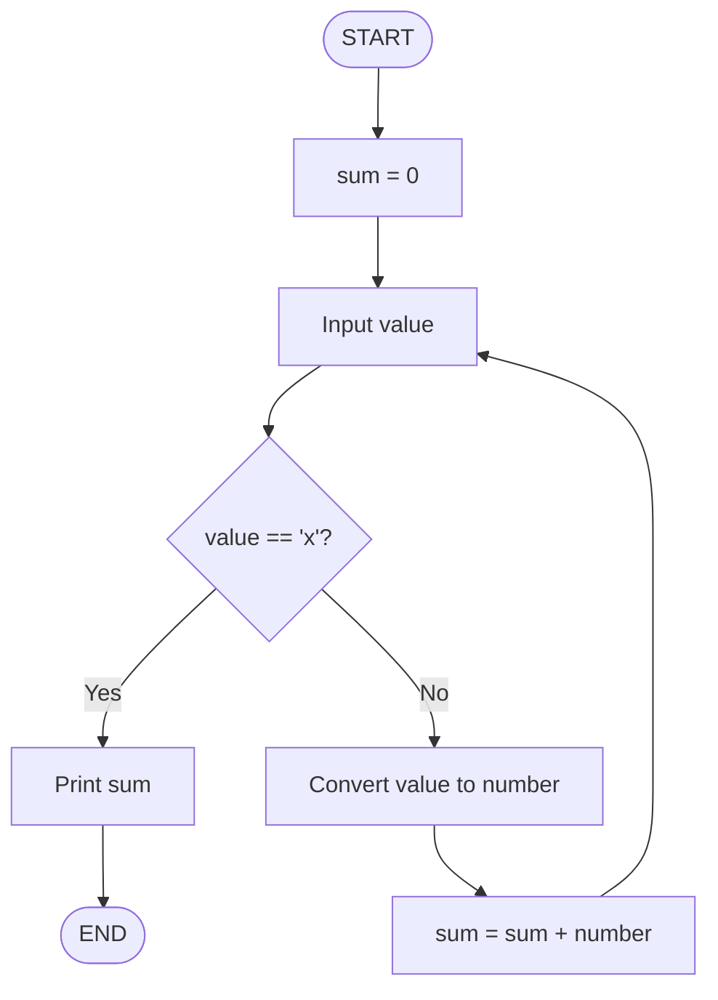

# Programming Problems: Flowcharts & Pseudocode

## Problem 1: Leap Year Checker

**Question:** Input a year and find whether it is a leap year or not.

**Flowchart:**


**Pseudocode:**
```
BEGIN
    PRINT "Enter a year: "
    INPUT year
    
    IF year % 4 == 0 THEN
        IF year % 100 == 0 THEN
            IF year % 400 == 0 THEN
                PRINT year + " is a leap year"
            ELSE
                PRINT year + " is not a leap year"
            END IF
        ELSE
            PRINT year + " is a leap year"
        END IF
    ELSE
        PRINT year + " is not a leap year"
    END IF
END
```

---

## Problem 2: Sum of Two Numbers

**Question:** Take two numbers and print the sum of both.

**Flowchart:**


**Pseudocode:**
```
BEGIN
    PRINT "Enter first number: "
    INPUT first_number
    
    PRINT "Enter second number: "
    INPUT second_number
    
    sum = first_number + second_number
    
    PRINT "Sum = " + sum
END
```

---

## Problem 3: Multiplication Table

**Question:** Take a number as input and print the multiplication table for it.

**Flowchart:**


**Pseudocode:**
```
BEGIN
    PRINT "Enter a number: "
    INPUT number
    
    FOR i = 1 TO 10 DO
        result = number * i
        PRINT number + " × " + i + " = " + result
    END FOR
END
```

---

## Problem 4: HCF and LCM

**Question:** Take 2 numbers as inputs and find their HCF and LCM.

**Flowchart:**


**Pseudocode:**
```
BEGIN
    PRINT "Enter first number: "
    INPUT a
    
    PRINT "Enter second number: "
    INPUT b
    
    orig_a = a
    orig_b = b
    
    WHILE b != 0 DO
        temp = b
        b = a % b
        a = temp
    END WHILE
    
    hcf = a
    lcm = (orig_a * orig_b) / hcf
    
    PRINT "HCF = " + hcf
    PRINT "LCM = " + lcm
END
```

---

## Problem 5: Sum Until User Enters 'x'

**Question:** Keep taking numbers as inputs till the user enters 'x', after that print sum of all numbers.

**Flowchart:**


**Pseudocode:**
```
BEGIN
    sum = 0
    
    LOOP
        PRINT "Enter a number (or 'x' to stop): "
        INPUT value
        
        IF value == 'x' THEN
            BREAK
        END IF
        
        number = CONVERT value TO NUMBER
        sum = sum + number
    END LOOP
    
    PRINT "Sum of all numbers = " + sum
END
```